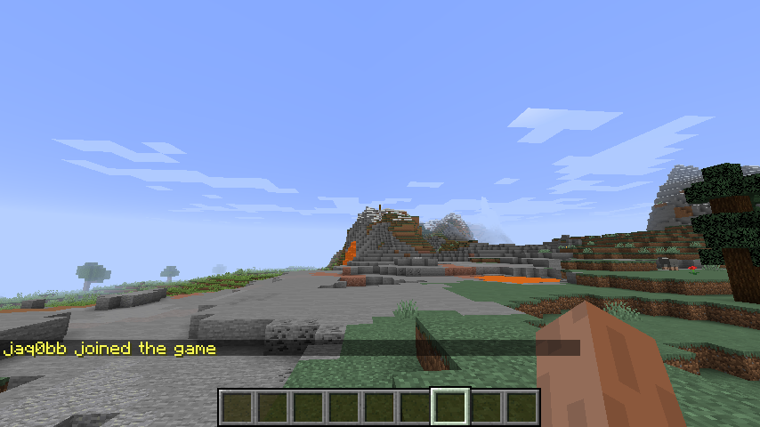
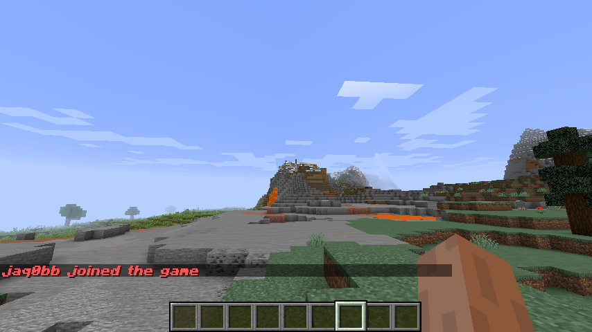

# Message Editor

Edit in-game messages that were previously unmodifiable. Message Editor allows server owners to edit default server messages or messages from other plugins, in an easy and user-friendly way. This is a perfect solution to edit messages that are hardcoded in plugins or server software and cannot be changed otherwise.

Click [here](https://www.spigotmc.org/resources/message-editor.82154/) to get to the plugin's SpigotMC page.

## Features

* Editing chat messages - since 1.0.0.
* Editing action bar messages - since 1.0.0.
* Editing kick/disconnect messages - since 1.1.0.
* Cancelling sending messages - since 1.2.4.
* Editing boss bar titles - since 1.3.0 (requires server version at least 1.9).
* Triggering message editing only on specific positions - since 1.3.2.
* Editing message positions - since 1.4.0.
* Editing scoreboard titles - since 1.5.0.
* Editing scoreboard entries - since 1.6.0.
* Editing messages with GUI - since 2.0.0.
* Editing inventory titles - since 2.2.0.
* Editing inventory item names - since 2.3.0.
* Editing inventory item lores - since 2.3.0.
* Editing entity names - since 2.4.0.
* Per-file message edit system - since 2.5.0.

## Showcase

Images below present a comparison between default messages and the same messages after being edited using Message Editor.

## Usage

## Requirements

* Server version 1.8+.
* Java 8+ prior to 2.5.5, and Java 21+ since 2.5.5.
* ProtocolLib 5.3.0+.
* PlaceholderAPI 2.11.6+ - only required if you wish to use placeholders in edited messages.
